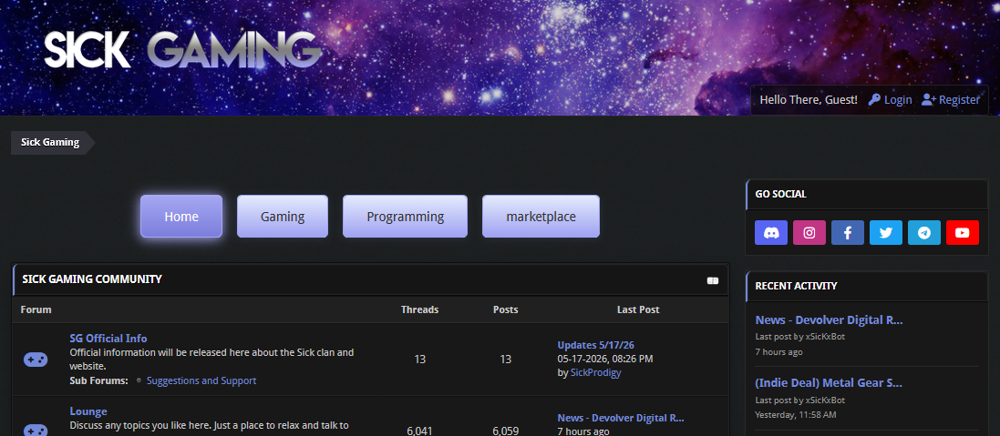

# MyBB Tab Sub Menu Plugin

A configurable tabbed navigation menu for organizing MyBB 1.8 forum categories.
It works independently of your theme and lets visitors quickly switch between
groups of forums from the board index.



## Features

- Per-tab lists of top-level forum category IDs.
- Plugin-owned responsive stylesheet installed into every MyBB theme automatically.
- Equal-width two-column phone layout with a single-column fallback for narrow screens.
- Optional show-all tabs with an empty ID list.
- Enabled/disabled flag for each tab.
- Remembers the visitor's selected tab in `localStorage`.
- Falls back to Home or the first configured tab.

## Install

Copy the contents of `Upload/` into the MyBB installation root:

```text
Upload/inc/plugins/tab_sub_menu.php -> public_html/inc/plugins/tab_sub_menu.php
Upload/jscripts/tab-sub-menu/tab-sub-menu.js -> public_html/jscripts/tab-sub-menu/tab-sub-menu.js
```

Then install and activate `Tab Sub Menu` under Admin CP → Configuration → Plugins. Activation installs `tab_sub_menu_plugin.css` into every existing theme and rebuilds the MyBB stylesheet caches.

## Upgrade

Replace the plugin files, then deactivate and reactivate **Tab Sub Menu**. Reactivation refreshes the plugin-owned stylesheet and MyBB theme caches. Version 0.5.1 also removes the untouched legacy default from **Custom Menu CSS** so it cannot override maintained responsive rules; administrator-authored custom CSS is preserved.

## Theme Integration

Activation installs and maintains `tab_sub_menu_plugin.css` in every theme, then automatically inserts `{$tab_sub_menu_assets}` into `headerinclude` and `{$tab_sub_menu}` immediately before `{$forums}` in the `index` template. Deactivation removes both insertions and the plugin-owned stylesheet from every theme.

If a customized template does not contain `{$stylesheets}` or `{$forums}`, add the corresponding plugin variable manually. Without the plugin, the normal `{$forums}` output continues to show the complete forum list.

Themes added, imported, or duplicated while the plugin is active receive the stylesheet automatically. The plugin generates this markup:

```html
<div id="forum-tab-sub-menu">
    <ul class="tab-sub-menu">
        <li data-tab="home" class="active">Home</li>
    </ul>
</div>
```

## Configuration

The plugin creates a `Tab Sub Menu` settings group with a row editor. Use **Add tab** and **Remove** to manage rows. Each row has a unique internal Tab ID (such as `gaming`), the Display name visitors see, comma-separated Forum/Category IDs, and an Enabled checkbox. Leave the IDs empty for a show-all tab.

The editor preserves the original format internally for compatibility:

```text
key|Label|comma-separated forum IDs|enabled
```

Initial configuration:

```text
home|Home||1
```

### Custom CSS

The **Custom Menu CSS** setting is added after the plugin-owned stylesheet, allowing appearance overrides without editing plugin files. The setting page includes an expandable read-only copy of the maintained stylesheet and an explicit button to copy those defaults into the custom field when a full editable starting point is preferred. Copied rules can override later plugin style updates, so targeted overrides are recommended. Common selectors include `#forum-tab-sub-menu`, `.tab-sub-menu li`, `.tab-sub-menu li.active`, and `.tab-sub-menu li:hover:not(.active)`.

Keys may contain letters, numbers, underscores, and hyphens. The parser does not impose a fixed group-count limit. Set enabled to `1` or `0`. An empty ID list creates a show-all tab when another enabled group contains IDs. If the setting is empty, disabled, or contains no IDs, the plugin recovers to the initial configuration.

## Uninstall

Uninstalling removes the plugin-owned stylesheets, the `Tab Sub Menu` setting group, and its settings. It does not modify unrelated templates or settings.

## License

Copyright (C) 2026 SickProdigy.

This project is licensed under the GNU General Public License, version 3 or any later version. See [LICENSE](LICENSE) for the complete license terms.
