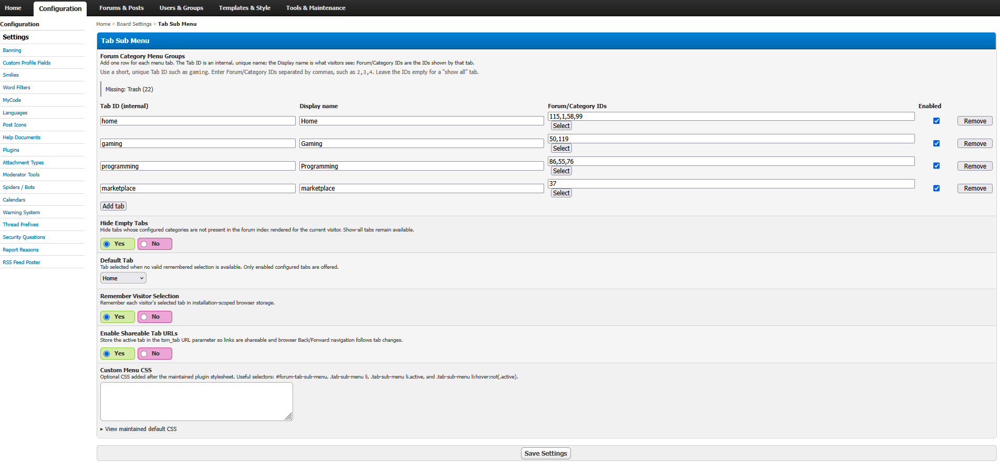

# MyBB Tab Sub Menu Plugin

A responsive tab menu for organizing MyBB 1.8 forum categories into configurable groups.


## Screenshots



## Features

- Configurable category/forum groups, labels, default tab, and show-all tabs.
- Searchable hierarchical Admin CP picker with category-only and mixed forum modes.
- Optional remembered selections and shareable `tsm_tab` URLs.
- Permission-aware empty-tab hiding with safe fallbacks.
- Responsive styling, keyboard navigation, and accessible tab markup.
- Automatic theme stylesheet and template synchronization.
- Custom CSS overrides without editing plugin files.
- English, Spanish, French, and Simplified Chinese language files.

## Installation

Copy the contents of `Upload/` into your MyBB installation root, then install and activate **Tab Sub Menu** under Admin CP → Configuration → Plugins.

Activation adds the plugin stylesheet and required template variables to every existing theme.

## Upgrading

Replace the plugin files and visit any Admin CP page. The plugin applies pending setting, template, and stylesheet updates automatically; deactivation and reactivation are not normally required. Existing settings, tab labels, and custom CSS are preserved.

See [CHANGELOG.md](CHANGELOG.md) for release and migration notes.

## Configuration

Open **Admin CP → Configuration → Settings → Tab Sub Menu**.

Each row contains:

- A unique internal Tab ID, such as `gaming`.
- The display name visitors see.
- Forum/Category selections made through the searchable hierarchy (manual IDs remain editable).
- An Enabled checkbox.

Leave the ID list empty to create a show-all tab. Additional settings control empty-tab hiding, the default tab, browser persistence, shareable URLs, and custom CSS.

Use **Top-level categories** mode to preserve category-wide filtering. Use **All forums and categories** mode to select individual forums, whole categories, or a mixture. Selecting one forum keeps its category heading visible while hiding unselected sibling forum rows. The picker marks IDs assigned to other tabs and supports filtering large forum trees by name or ID.

Selections resolve in this order: a valid URL tab, a remembered tab, the configured default, then the first available tab. Invalid, inaccessible, or deleted categories fail safely without hiding the complete forum index.

### Custom CSS

**Custom Menu CSS** loads after the maintained plugin stylesheet. The settings page provides a read-only stylesheet reference and an option to copy it as a starting point. Targeted overrides are recommended because copied defaults can override later plugin style updates.

### Languages

Bundled translations are stored under `Upload/inc/languages/english/`, `spanish/`, `french/`, and `chinese/`. The directory must match the installed MyBB language pack; copy the appropriate plugin files if your pack uses a different directory name.

Administrator-configured tab labels are never automatically translated or overwritten.

## Theme compatibility

The plugin works automatically with stock MyBB 1.8 and the responsive Space Cadet theme. Themes added, imported, or duplicated while the plugin is active receive the required stylesheet and template changes automatically.

Heavily customized themes may use different forum-category markup. If tabs do not filter correctly, the theme author can add the category ID to each outer category container:

```html
<section data-tab-sub-menu-category="{$forum['fid']}">...</section>
```

For individual-forum mode, mark each rendered forum row as well:

```html
<div data-tab-sub-menu-forum="{$forum['fid']}">...</div>
```

If the plugin cannot recognize a theme's category markup, it leaves the complete forum index visible rather than hiding content.

## Compatibility

Supports MyBB 1.8.x, PHP 7.4–8.4, and current or previous major versions of Chrome, Firefox, Edge, and Safari. Remembered tab selections expire after 24 hours, returning visitors to the configured default tab. With JavaScript or browser storage unavailable, the complete forum index remains usable.

## Uninstalling

Uninstalling removes plugin settings, cache state, stylesheets, and template changes without modifying unrelated MyBB data.

## License

Copyright © 2026 SickProdigy. Licensed under [GPL-3.0-or-later](LICENSE).
